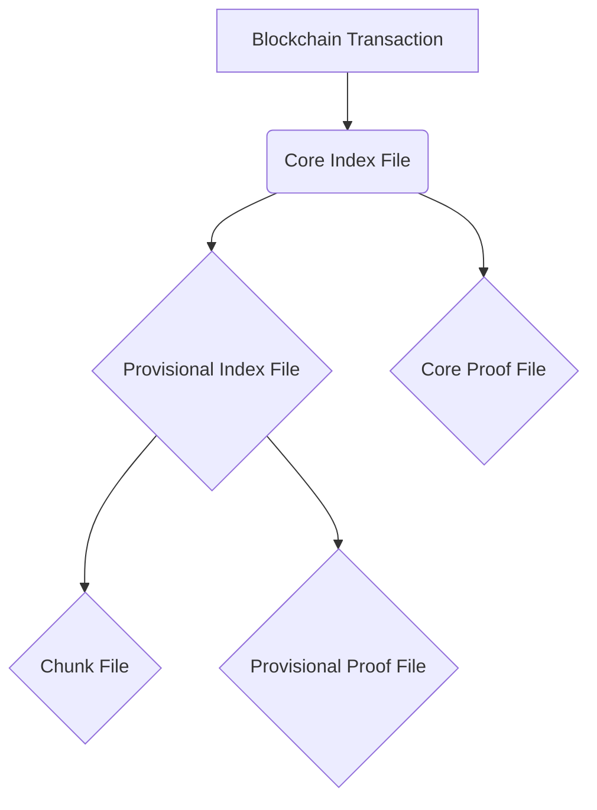

# Sidetree IPFS Data Structure

This document explains the structure of data stored on IPFS for Sidetree operations and how it is anchored to the blockchain.

## The Anchored Data Structure

The IPFS hash that is anchored on the Ethereum blockchain in the `SimpleSidetreeAnchor.sol` contract is not a direct hash of the operations themselves. Instead, it's the hash of a **Core Index File**, which acts as the root of a tree-like structure of files stored on IPFS.

This structure is designed to be efficient and scalable. Here’s a breakdown of how it works, starting from the transaction anchored on the blockchain and drilling down into the IPFS files.

### 1. The Blockchain Anchor

The data anchored on the blockchain is a simple string with two parts, delimited by a dot (`.`):

```
<number-of-operations>.<core-index-file-uri>
```

-   **`numberOfOperations`**: The total number of Sidetree operations included in this batch.
-   **`coreIndexFileUri`**: The IPFS hash (CID) of the Core Index File.

This serialization is handled by the `AnchoredDataSerializer.ts` file in `@sidetree/core`.

### 2. The IPFS File Structure

The `coreIndexFileUri` points to a compressed JSON file that contains the following main properties:

-   **`provisionalIndexFileUri`**: An IPFS hash pointing to the Provisional Index File.
-   **`coreProofFileUri`**: An IPFS hash pointing to the Core Proof File (if any recover or deactivate operations are present).
-   **`operations`**: An object containing arrays of operation references for `create`, `recover`, and `deactivate` operations.

This structure creates a nested hierarchy of files on IPFS. Here is a visualization of the relationships:



Let's look at what each of these files contains:

-   **Core Index File** (`CoreIndexFile.ts`):
    -   This is the root of the batch. It contains references to all the operations in the batch, either directly or through links to other files.
    -   `create` operations are listed here with their `suffixData`.
    -   `recover` and `deactivate` operations are also listed, along with their reveal values.

-   **Provisional Index File** (`ProvisionalIndexFile.ts`):
    -   This file primarily deals with `update` operations.
    -   It contains a link to the **Chunk File** and the **Provisional Proof File**.

-   **Chunk File** (`ChunkFile.ts`):
    -   This is where the **deltas** for `create`, `recover`, and `update` operations are stored.
    -   The `deltas` property is an array of JSON objects, where each object represents the changes to be applied to a DID document. This is the core data of the operations.

-   **Core Proof File** & **Provisional Proof File** (`CoreProofFile.ts` and `ProvisionalProofFile.ts`):
    -   These files contain cryptographic proofs for the operations. The proofs are separated into "core" (for recoveries and deactivations) and "provisional" (for updates) to allow for different processing logic.

### How It All Comes Together

The process, orchestrated by `BatchWriter.ts`, is as follows:

1.  A batch of operations is collected from the operation queue.
2.  The operations are processed to create the various files (Chunk, Proofs, etc.).
3.  Each of these files is individually uploaded to IPFS, yielding a unique hash for each.
4.  The hashes are then used to construct the index files (`Provisional` and `Core`).
5.  The Core Index File is uploaded to IPFS, and its hash is combined with the number of operations to form the anchor string.
6.  This anchor string is then sent to the `SimpleSidetreeAnchor.sol` smart contract to be stored on the blockchain.

So, to answer your question directly: yes, the IPFS hash anchored on-chain ultimately leads to a set of deltas, but they are nested within a structured set of files designed for efficient resolution and processing.