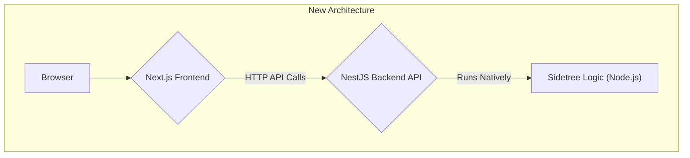

# Sidetree API Migration Plan: From Next.js to NestJS

## 1. Overview

### Problem
The current Next.js application in `packages/dashboard` is tightly coupled with the Sidetree node logic. This has led to significant build and dependency issues, as webpack 5 no longer provides automatic polyfills for the Node.js core modules that the Sidetree packages rely on. This makes the development process difficult and the application unstable.

### Solution
To resolve these issues, we will decouple the Sidetree node logic from the Next.js frontend by creating a dedicated backend service using NestJS. This will create a clear separation of concerns, with the Next.js application acting purely as a frontend and the NestJS application handling all the backend Sidetree operations.

## 2. New Architecture

The proposed architecture will consist of two separate applications:

-   **Next.js Frontend**: A dedicated frontend application responsible for the user interface. It will make HTTP API calls to the NestJS backend to interact with the Sidetree node.
-   **NestJS Backend**: A standalone backend service that runs the Sidetree node and exposes a REST API for the frontend to consume.



## 3. Project Setup

The first step is to create a new NestJS application within the `packages` directory.

1.  **Install NestJS CLI** (if not already installed):
    ```bash
    npm install -g @nestjs/cli
    ```

2.  **Create the NestJS Application**:
    ```bash
    cd packages
    nest new sidetree-node-api
    ```

This will create a new directory named `sidetree-node-api` with a boilerplate NestJS application.

## 4. Backend Migration Plan (NestJS)

The core of this migration is to move all the Sidetree-related logic to the new NestJS application.

### 4.1. Sidetree Service

We will create a `SidetreeService` in the NestJS application. This service will be a singleton responsible for:
-   Initializing the Sidetree node instance.
-   Providing methods to interact with the Sidetree node (e.g., `handleResolveRequest`, `handleOperationRequest`, `getTransactions`).

This will encapsulate all the Sidetree logic in one place, making it easy to manage and maintain.

### 4.2. Configuration

We will use NestJS's built-in `ConfigModule` to manage the Sidetree node configuration. This will allow us to use `.env` files to configure the Sidetree node, just like in the current setup.

### 4.3. API Endpoints

We will create NestJS controllers to expose the Sidetree functionality through a REST API. The following endpoints will be created to mirror the existing API:

-   **`GET /api/1.0/identifiers/:did`**: Resolves a DID.
-   **`GET /api/1.0/operations`**: Retrieves operations for a DID.
-   **`POST /api/1.0/operations`**: Submits a new Sidetree operation.
-   **`GET /api/1.0/transactions`**: Fetches the latest Sidetree transactions.
-   **`GET /api/1.0/version`**: Returns the Sidetree node version.

## 5. Frontend Refactoring Plan (Next.js)

Once the NestJS backend is up and running, we will refactor the Next.js dashboard.

### 5.1. Remove API Routes

All the files in `packages/dashboard/pages/api` will be deleted. The Next.js application will no longer have any server-side API logic.

### 5.2. Update Frontend Components

The frontend components will be updated to make HTTP requests to the new NestJS backend. We will use a library like `axios` or the built-in `fetch` API to make these calls. The base URL for the API calls will be configurable, so it can be pointed to the NestJS backend in different environments.

## 6. Running the New Architecture

The new setup will require running two separate services:

1.  **Start the NestJS Backend**:
    ```bash
    cd packages/sidetree-node-api
    npm run start:dev
    ```

2.  **Start the Next.js Frontend**:
    ```bash
    cd packages/dashboard
    npm run dev
    ```

## 7. Benefits

This new architecture will provide several key benefits:

-   **Improved Stability**: By separating the frontend and backend, we eliminate the webpack build issues.
-   **Better Separation of Concerns**: The frontend and backend will have clear and distinct responsibilities.
-   **Enhanced Scalability**: The frontend and backend can be scaled independently.
-   **Improved Maintainability**: The codebase will be cleaner and easier to understand and maintain.